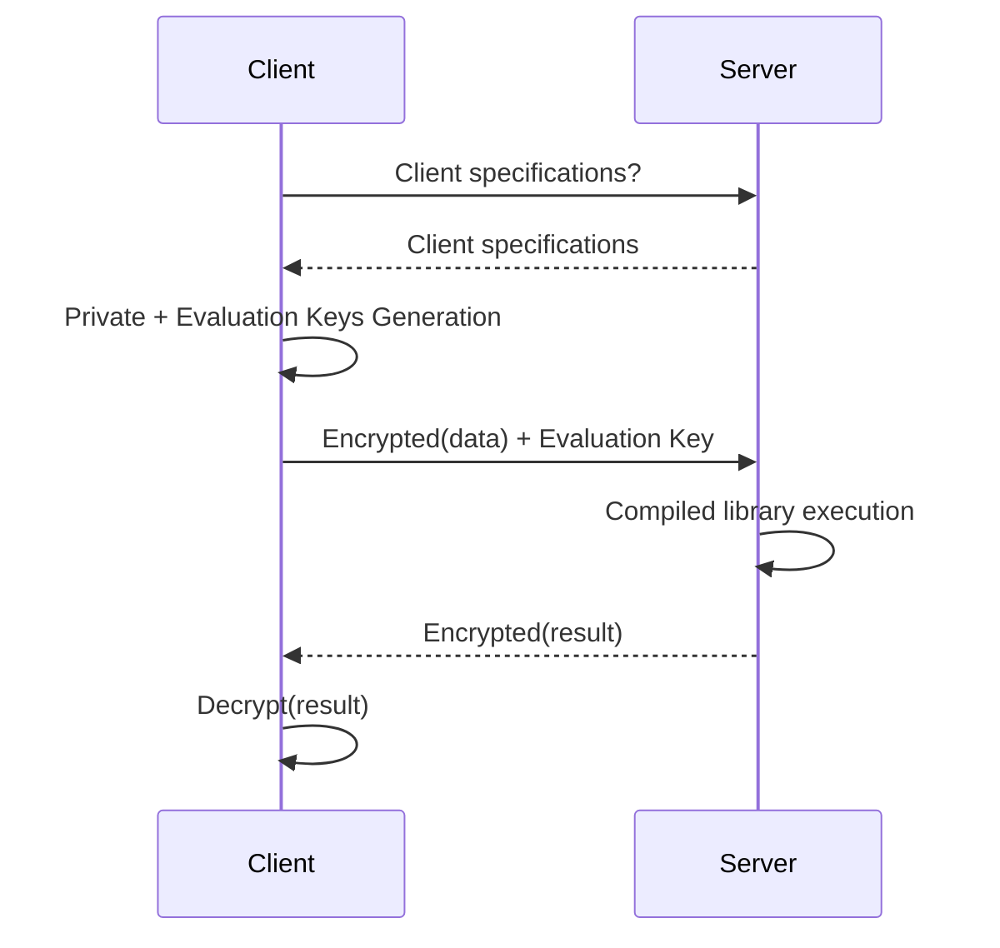

# Overview
This document explains the basic principles, key concepts, and workflow of how **Concrete** performs computations on encrypted data homomorphically.

## Operations on encrypted values

Homomorphic encryption allows you to perform computations on ciphertexts without knowing the underlying messages.  A scheme is considered [fully homomorphic](https://en.wikipedia.org/wiki/Homomorphic\_encryption#Fully\_homomorphic\_encryption) if it supports an unlimited number of additions and multiplications. ($$x$$ is a plaintext and $$E[x]$$ is the corresponding ciphertext):

* homomorphic addition: $$E[x] + E[y] = E[x + y]$$
* homomorphic multiplication: $$E[x] * E[y] = E[x * y]$$

## Noise and Bootstrap

FHE encrypts data as Learning With Errors (LWE) ciphertexts. 

The following illustration visualize LWE ciphertexts as a bit vector. The higher-order bits in yellow contain the encrypted message, while the lower-order bits in gray contain a random part called **noise**, which ensures the security of the encrypted message.

Each time you perform an operation on an encrypted value, the noise increases. Eventually, the noise may overlap with the message, corrupting its value.


You can reduce the noise in a ciphertext using the **bootstrapping operation**. The bootstrapping operation takes a noisy ciphertext as input and generates a new ciphertext encrypting the same message, but with a lower noise. This reduction allows you to perform additional operations on the encrypted message.

A typical FHE program consists of a series of operations followed by a bootstrapping, then the process is repeated many times.

## Probability of Error

The amount of noise in a ciphertext is not as limited as it may seem in the illustration above. Since the errors are drawn randomly from a Gaussian distribution, they can vary in size. It is essential to ensure that the noise terms do not interfere with the message bits. If the error terms overflow into the message bits, they can cause an incorrect output (failure) during bootstrapping.

In **Concrete**, the default failure probabilityis is set to $$\frac{1}{100000}$$. This means that 1 out of every 100,000 executions may result in an incorrect output. To have a lower probability of error, you need to change the cryptographic parameters, likely resulting in worse performance. On the other side of this trade-off, allowing a higher probability of error will likely speed-up operations.

To reduce the probability of error, you need to adjust the cryptographic parameters, which may degrade performance. On the contrary, allowing a higher probability of error may speed up the operations.

## Function evaluation

Besides the arithmetic operations that we have introduced, a typical program usually also involves functions, such as maximum, minimum, square root and so on.

During the bootstrapping operation in TFHE, you can perform a table lookup simultaneously to reduce noise, turning the bootstrapping operation into a Programmable Bootstrap (PBS).

Concrete uses the PBS to support function evaluation:

* Homomorphic univariate function evaluation: $$f(E[x]) = E[f(x)]$$

Here is a simple example: a function (or circuit) that takes a 4-bit input variable and output the maximum value between a clear constant and the encrypted input:

```python
import numpy as np

def encrypted_max(x: uint4):
    return np.maximum(5, x)
```

This function can be turned into a table lookup:

```python
def encrypted_max(x: uint4):
    lut = [5, 5, 5, 5, 5, 5, 6, 7, 8, 9, 10, 11, 12, 13, 14, 15]
    return lut[x]
```

**Concrete** apply this lookup table `lut` during the Programmable Bootstrap.

## PBS management

During compilation, **Concrete** handles the entire PBS management by turning each function evaluation into a lookup table and then evaluating it by a PBS. You don't have to manage PBS by yourself.

Refer to the previous example. If you output the MLIR code produced by the frontend, you'll see the lookup table value on the 4th line (ignore the MLIR syntax):

```c++
module {
  func.func @main(%arg0: !FHE.eint<4>) -> !FHE.eint<4> {
    %cst = arith.constant dense<[5, 5, 5, 5, 5, 5, 6, 7, 8, 9, 10, 11, 12, 13, 14, 15]> : tensor<16xi64>
    %0 = "FHE.apply_lookup_table"(%arg0, %cst) : (!FHE.eint<4>, tensor<16xi64>) -> !FHE.eint<4>
    return %0 : !FHE.eint<4>
  }
}
```

Keep in mind that PBS adds a constraint on the input type, which is why there is a maximum bit width supported in Concrete.

Additionally, PBSs are the most costly operations in FHE. The fewer PBS you have in your circuit, the faster the execution runs. **Concrete** can provide you with the number of PBSs used in your circuit, which is a useful metric to optimize.

Note that PBS cost varies with input variable precision. A circuit with 8-bit PBS will run faster than one with 16-bit PBS.

## Development Workflow

Computation on encrypted data is particularly useful in the client/server model, especially when the client data are sensitive and the server is not trusted. 

You can split the workflow in two main steps: development and deployment.

### Development

During development, you will convert your program into its FHE equivalent. **Concrete** automates this task through the compilation process. You have additional ways to simplify this process further:
- Reducing the precision required
- Decreasing the number of PBSs
- Allowing more parallelization in your code. For example, working on bit chunks instead of high bit-width variables.

Once you finish the code, the development process is complete, and you will create the compiler artifact that will be used during deployment.

### Deployment

A typical **Concrete** deployment hosts the compilation artifact on a server. This includes the client specifications required by the compiled circuits and the FHE executable itself. 

The client will go through the following steps:
1. Request the circuit requirements
2. Generate keys accordingly
3. Send an encrypted payload
4. Receive an encrypted result




For more information on deployment, see [the deployment documentation](../guides/deploy.md)
